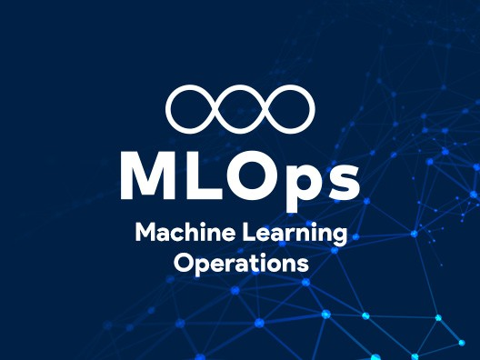

# **Project Name: ECF5 - ChurnGuard MLOps (Telco Customer Churn Prediction)** 


---

## Table of Contents

1. [About the Project](#about-the-project)
2. [Built With](#built-with)
3. [Project Structure](#project-structure)
4. [Getting Started](#getting-started)
   - [Prerequisites](#prerequisites)
   - [Installation](#installation)
   - [Docker Setup](#docker-setup)
5. [Usage](#usage)
   - [Training Models](#training-models)
   - [Running the API](#running-the-api)
   - [API Endpoints](#api-endpoints)
6. [MLflow Tracking](#mlflow-tracking)
7. [Docker](#docker)
8. [Authors](#authors)
9. [License](#license)

---

## About the Project

**ChurnGuard** is an end-to-end **MLOps pipeline** for predicting customer churn for a telecom operator (TelcoFr, 1.2M customers).

The goal is to industrialize a machine learning model initially developed in a notebook and transform it into a **production-ready system**.

### Key Features

- Data ingestion and preprocessing pipeline
- Model training (Logistic Regression, Random Forest, Gradient Boosting)
- Experiment tracking with **MLflow**
- Model registry with **Production promotion via alias**
- REST API with **FastAPI**
- Full containerization with **Docker Compose**

---

## Built With

-  **Python 3.11** – Core language  
-  **Scikit-learn** – ML models  
-  **FastAPI** – REST API  
-  **MLflow** – Experiment tracking & registry  
-  **Pandas** – Data processing  
-  **NumPy** – Numerical computations  
-  **Docker** – Containerization  
-  **Uvicorn** – API server  

---

## Project Structure

```text
.
├── api/
│   └── main.py              # FastAPI application
├── churnguard/
│   ├── data.py              # Data loading & preprocessing
│   ├── train.py             # Training + MLflow logging
│   └── evaluate.py          # Metrics computation
├── tests/
│   ├── test_data.py
│   └── test_train.py
├── scripts/
│   └── download_data.py     # Dataset download (IBM Telco Churn)
├── data/
│   └── telco_churn.csv
├── mlruns/                  # MLflow artifacts
├── dockerfile.api
├── dockerfile.trainer
├── docker-compose.yml
├── requirements.txt
└── README.md
```

## GETTING STARTED

### Prerequisites

Before you can install the project, make sure you have the following installed on your machine and to have basic knowledge of the following technologies:

- **Python 3.10+**  
  - [Install Python](https://www.python.org/downloads/)  

- **Git** – Version control.  
  - [Install Git](https://git-scm.com/downloads)  

- **Docker**
  - [Install Docker](https://docs.docker.com/desktop/setup/install/windows-install/)

- **Postman** (Optionnal, to try api, cURL)
  - [Install postman](https://www.postman.com/downloads/)

### Installation

- Clone the repository:

```bash
git clone https://github.com/titibemo/ECF_5_mlops
```

Open a terminal and enter in the fold:
```bash
cd ECF_5_mlops
```

### Working locally

**OPTIONAL**
If you want to work locally on the project you should install

- Create and activate a virtual environment:

```bash
python -m venv venv

# Windows:
venv\Scripts\activate

# macOS/Linux:
source venv/bin/activate
```

- Install dependencies:

```bash
pip install -r requirements.txt
```

### Docker Setup

Docker compose contain three service :
- mlflow : Tracking server + model registry
- trainer: Trains models and logs them to MLflow
- api : FastAPI inference server

```yaml
services:
  mlflow:
    image: ghcr.io/mlflow/mlflow
    command: >
      mlflow server
      --host 0.0.0.0
      --port 5000
      --backend-store-uri sqlite:///mlflow.db
      --default-artifact-root ./mlruns
      --allowed-hosts "*"
    ports:
      - "5000:5000"

  trainer:
    build:
      context: .
      dockerfile: Dockerfile.trainer
    depends_on:
      - mlflow
    environment:
      - MLFLOW_TRACKING_URI=http://mlflow:5000
    command: python churnguard/train.py

  api:
    build:
      context: .
      dockerfile: Dockerfile.api
    ports:
      - "8000:8000"
    depends_on:
      - mlflow
    environment:
      - MLFLOW_TRACKING_URI=http://mlflow:5000
```

From the root of the application, open a terminal and run the following command to dockerize the application:

```bash
docker compose up --build
```

## Usage

### Training Models

The training is automated via the trainer container, by clicking on the container on docker desktop or by running. **CAREFULL, TRAINER DEPENDS ON THE CONTAINER MLflow, he MUST be running**: 
```bash
docker compose up trainer
```
The system will:

- Load dataset
- Train 3 models: Logistic Regression; Random Forest, Gradient Boosting
- Log metrics to MLflow
- Select best model (ROC-AUC)
- Register model in MLflow registry
- Promote it to production alias


### Running the API

Once containers are up, you can access to the api on this address:

```bash
http://127.0.0.1:8000/docs
```

### API Endpoints

#### GET /health

Response:
```json
{
  "status": "ok",
  "model": "churnguard",
  "loaded": true
}
```

---

#### POST /predict

```json
{
  "gender": "Female",
  "SeniorCitizen": 0,
  "Partner": "Yes",
  "Dependents": "No",
  "tenure": 1,
  "PhoneService": "Yes",
  "MultipleLines": "No",
  "InternetService": "DSL",
  "OnlineSecurity": "No",
  "OnlineBackup": "No",
  "DeviceProtection": "No",
  "TechSupport": "No",
  "StreamingTV": "No",
  "StreamingMovies": "No",
  "Contract": "Month-to-month",
  "PaperlessBilling": "Yes",
  "PaymentMethod": "Electronic check",
  "MonthlyCharges": 29.85,
  "TotalCharges": 29.85
}
```

Response:

```json
{
  "churn": false,
  "probability": "Bool|null"
}
```

#### POST /predict/batch

```json
[
  {
    "gender": "Female",
    "SeniorCitizen": 0,
    "Partner": "Yes",
    "Dependents": "No",
    "tenure": 1,
    "PhoneService": "Yes",
    "MultipleLines": "No",
    "InternetService": "DSL",
    "OnlineSecurity": "No",
    "OnlineBackup": "No",
    "DeviceProtection": "No",
    "TechSupport": "No",
    "StreamingTV": "No",
    "StreamingMovies": "No",
    "Contract": "Month-to-month",
    "PaperlessBilling": "Yes",
    "PaymentMethod": "Electronic check",
    "MonthlyCharges": 29.85,
    "TotalCharges": 29.85
  },
  {
    "gender": "Male",
    "SeniorCitizen": 1,
    "Partner": "No",
    "Dependents": "No",
    "tenure": 24,
    "PhoneService": "Yes",
    "MultipleLines": "Yes",
    "InternetService": "Fiber optic",
    "OnlineSecurity": "No",
    "OnlineBackup": "Yes",
    "DeviceProtection": "Yes",
    "TechSupport": "No",
    "StreamingTV": "Yes",
    "StreamingMovies": "Yes",
    "Contract": "One year",
    "PaperlessBilling": "Yes",
    "PaymentMethod": "Credit card (automatic)",
    "MonthlyCharges": 89.10,
    "TotalCharges": 2138.40
  }
]
```

Response:

```json
[
  {
    "churn": false,
    "probability": "Bool|null"
  },
  {
    "churn": true,
    "probability": "Bool|null"
  }
]
```

## MLflow Tracking

Once containers are up, you can access to the mlflow server on this address:

http://127.0.0.1:5000

Features:
- Experiment tracking
- Metrics logging: accuracy, precision, recall, f1-score
ROC-AUC
- Model registry
- Production alias: models:/churnguard@production

## Uninstall

To uninstall the project and remove all associated volumes, run the following command:

```bash
docker compose down -v
```

## [Authors](#authors)

- [GitHub Profile](https://github.com/titibemo)

## [License](#license)

This project is open-source and can be freely copied, modified, and distributed by anyone. No specific license is provided, but contributions and usage are welcome.